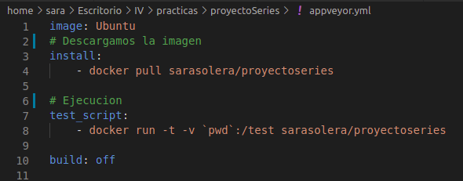

# Aprovechando docker para CI
## TRAVIS
En el caso de travis, puede compilar, ejecutar e incluso enviar imágenes a repositorios de Docker.
Para usar Docker es necesario agregar la etiqueta services. 

En mi caso el primero fichero dockerfile que cree anteriormente tenia la versión 10 de node, tras probar del 11 al 15, voy a modificarlo para agregar la versión 11.
Tras esto modifico .travis.yml, para no eliminar el fichero anterior, lo he copiado en una carpeta, podemos encontrar la antigüa configuración [aquí](https://github.com/sarasolera/proyectoSeries/blob/master/docs/ficheros_originales/travis_sin_docker.yml)

Añadiendo docker a nuestra configuración:

Tenemos que recordar que docker ya incluye una versión de node, asi que si indicamos el lenguaje puede provocar errores al mantener diferentes versiones. Una compañera pasó la solución a esto, documentación de la [página oficial](https://docs.travis-ci.com/user/languages/minimal-and-generic/#minimal). Al añadir language: minimal, se activará la compilación de travis, generará un entorno virtual mínimo para poder ejecutar docker  y no producirá errores.

## APPVEYOR
De la misma manera que para travis, para no perder el fichero de configuración inicial lo podemos encontrar [aqui](https://github.com/sarasolera/proyectoSeries/blob/master/docs/ficheros_originales/appveyor_sin_docker.yml). Fichero de configuración aprovechando docker:

Como vemos en appveyor es muy simple, indicamos el entorno en el que queremos ejecutarlo, descargamos la imagen subida en dockerHub y ejecutamos docker run.

