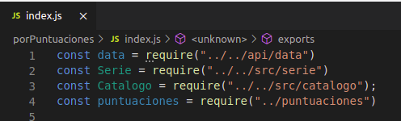

# Desplegando en Azure
Para pobrar distintas plataformas decidí probar con Azure Functions.
Para ello seguí este [tutorial](https://dev.to/akhromieiev/building-a-telegram-bot-with-azure-functions-and-node-js-28b), solo la parte de despliegue.

Lo diferente de Azure functions es que compila y depura a nivel local sin ninguna configuración adicional.
## ¿Qué necesitamos?
Para hacer un despliegue correcto en Azure necesitamos:  visual studio, que es donde vamos a trabajar, node y la extensión de Azure Functions, la cual nos permitir realizar la función.

## ¿Qué pasos debemos seguir?

1. Crearnos un proyecto, para ello yo he creado la carpeta azure en la raíz de mi proyecto, y dentro de ella voy a crear la funcion porPuntuacion.
Esta función nos va a devolver las series del catálogo de mayor a menos puntuación, si consultamos las historias de usuario, es la HU04 Consultar catálogo según puntuación #19.
    - Para crearnos ese proyecto debemos tener la extensión azure en visual.
    - Cuando seleccionemos Create New Project nos pedirá la carpeta donde queremos crearlo, en mi caso dentro de mi proyecto selecciono azure, tras ello seleccionamos lenguaje, **javascript** y tras ello nos da a elegir una plantilla para nuestra función, en mi caso quiero una **HTTP trigger** y damos el nombre de la función, seleccionamos function y comenzamos

2. Tras realizar el paso uno, vamos a tener ficheros propios del proyecto, y una carpeta porPuntuaciones, cuyo contenido es:

        - index.js que es dónde voy a implementar mi función, y donde vamos a trabajar la petición y respuesta HTTP.
        - functions.json es un fichero de configuración que se crea por defecto con datos del proyecto.

3. Toca implementar la función a desplegar, este código se hará en [index.js](https://github.com/sarasolera/proyectoSeries/blob/master/azure/porPuntuaciones/index.js) para ello eliminamos parte del contenido que trae la plantilla HTTP trigger, y comienzo a escribir mi código, el cual voy a explicar por zonas:

Lo primero es exportar los datos necesarios:

    - data: que es una lista de diccionario de series para crear el catalogo, ya creado para mi  función en Vercel, por lo que reutilizo.
    - Mis clases para porder generar los objetos y utilizar las funciones necesarias.
    - Puntuaciones es un fichero de datos, creado para esta funcion, contiene por cada serie un diccionario con nombre_serie : lista con puntos, más tarde se verá como capto los datos y como los uso.

 - Genero mi objeto catálogo, y captando de data, genero objetos series, cada serie la añado al catálogo para luego poder puntuarla y obtenerlas ordenas.

 - Del fichero puntuaciones, obtenemos la lista de puntuaciones de cada serie, la añadimos con sumarPuntos, esta función al final generará la media de todos los puntos, fijandose en eso se ordenarán.

 - Con la funcion mostrarSeriesPuntuacion() obtenemos una lista de las series ordenadas por puntuacion, tras ello formamos una lista de diccionarios con los el nombre y puntuación de cada serie.

 - Apunte: toFixed(2) redondea los float para quedarse solo con dos decimales.

 - Por último enviamos la respuesta a la petición, con azure es muy simple, se utiliza el objeto context.res como objeto para responder, en el indicamos body, el objeto que contiene la respuesta y le introducimos el responseMessage formado con el diccionario datosJSON. Ademas de body context.res contiene más propiedades como headers, status etc. Toda esta información la podemos obtener de una página de [documentación](https://github.com/MicrosoftDocs/azure-docs/blob/master/articles/azure-functions/functions-reference-node.md)

## Desplegamos
Recordar que es necesario Azure Functions Core Tools para el despliegue, para instalarlo:
- npm i -g azure-functions-core-tools@3 --unsafe-perm true

Una vez disponemos de esta herramienta en code ya podemos desplegar nuestra funcion , para ello clicamos en Run --> Start Debugging o ejecutando **func start**. Esta ejecución nos proporciona el enlace a la función:

Si accedemos a él:

En el resultado podemos ver la URL, y si observamos la puntuacion de cada serie vemos que efectivamente están ordenadas de mejor a peor puntuación.

