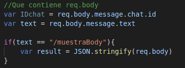
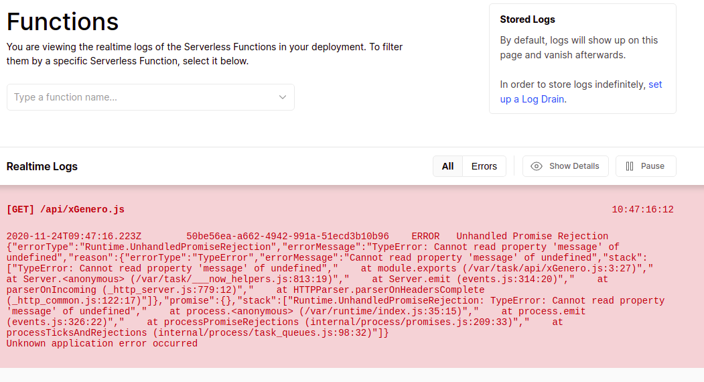
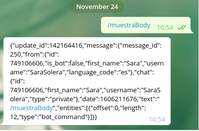
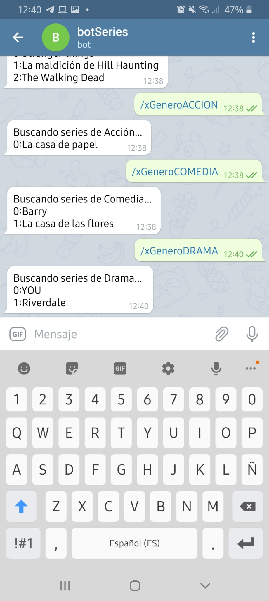

# BOT TELEGRAM
Para realizar un bot de telegram he elegido desplegarlo en la plataforma de vercel.

## Primero y lo más fácil
Habla con bot father, permite crear nuevas cuentas de bots, eliges el nombre de tu cuenta y un username, y
tras esto te cederá un token que indicaremos en el webhook.

## Despliegue y webhook 
Antes de realizar pruebas necesitaba "enlazar" mi función desplegada y mi  bot de telegram, para ello encontre esta [página](https://riptutorial.com/es/telegram-bot/example/32215/configurar-el-webhook) 
que indicaba como configurar el webhook de una manera muy sencilla:

La llamada es https://api.telegram.org/bot< token >/setwebhook?url=< yoururl >.
Donde pone token indicamos el token de nuestro bot que nos ha dado el bot father, y en URL pues la url donde tenemos deplegada nuestra función.
De esta manera cada vez que mi bot reciba una petición esta sería enviada a mi función.

## Creación del código para captar mensajes y devolver mensaje a telegram
Tras ver el ejemplo del profesor vi que era necesario el ID chat del mensaje y por supuesto el contenido.
Para ello tras leer el grupo en el que se consultaron algunas dudas, y buscar en internet encontre que era:

    - req.body.message.text para obtener el contenido del mensaje
    - req.body.chat.id para obtener el id 

Aun así mostre el contenido del body para conocerlo más a fondo:

.

¡ERROR!

El problema es que tomaba req.body como undefined, en algún momento el contenido del body era undefined, la solución más fácil es controlar que no capte message si req.body es undefined.

Tras este pequeño arreglo, el resultado al enviarle ese mensaje a mi bot era:

Pues ya lo tenemos de req.body puedo captar:

    - Text haciendo: req.body.message.text
    - Id del chat haciendo: req.body.message.from.id o req.body.chat.id.

El resto del código es muy simple, mediante req.body.message.text captaba que me pedían si estaba entre mis opciones, se pueden ver el código fuente, devolver las series de ese genero, si no devolver un mensaje por defecto.

## Cómo enviar una respuesta
En el ejemplo de JJ podemos ver que es necesario:

    1. Formar un json, ¿por qué? porque es necesario indicar el texto y su contenido, el método , en este caso enviar mensaje, y el id del chat para que sepa donde ir.
    2. Indicar en la cabecera que el contenido será json, para ello en vercel indicamos la cabecera mediante res.setHeader.

Tras ello finalmente tenemos nuestro boot configurado, cada línea del código está explicada.

## Funcionamiento

