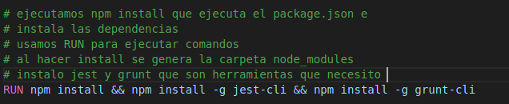
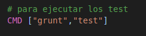
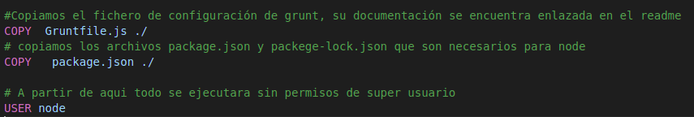

# Buenas prácticas para obtener un mejor contenedor resultante.

## Objetivos de unas buenas prácticas
    - Conseguir minimizar el tamaño de la imágen, el tiempo de compilación y el número de capas.
    - Maximizar el uso de la caché y la legibilidad del dockerfile.
    - Obtener un contenedor que sea agradable.

## El contenedor debe ser concreto: UNA TAREA.
Siempre que sea posible es recomendable no realizar diferentes procesos ya que esto puede alargar los tiempos de compilación, incrementar el tamaño de las imágenes, generar problemas con procesos zombie, etc.

## Imágenes y versiones específicas.
Lo más recomendable es basarse en las imágenes oficiales, ya que es más fácil encontrar una mayor documentación. Como ya estuve comparando las diferentes imágenes que encontre adecuadas para mi proyecto, en mi caso elegi la imágen oficial de node con alpine.

## Directorio y dockerignore.
Otra buena práctica es siempre trabajar sobre un directorio vacío, solo con el Dockerfile y los archivos minimos necesarios para la imágen. Si tenemos archivos que no queremos que se incluyan al ejecutar build podemos hacer un fichero .dockerignore.

En el caso de usar node, al ejecutar npm install, se crea la carpeta node_modules, esta carpeta debe estar en el contenedor, por lo que podemos hacer un fichero dockerignore así:

Es importante tener claro el objetivo con el que creamos nuestro Dockerfile, y minimizar el número de capas.

## Instrucciones específicas.
    - RUN : debe ser legible y entendible, dividir comandos extensos y complicados en multilíneas, ya que cada comando de Docker crea una capa, y se almacenan en caché, el uso de multilíneas permite reducir esto.

    -CMD: es una ejecucuón de comandos por defecto trás crear el contenedor, en mi caso mi objetivo es ejecutar los test.

    - ADD y COPY tienen uncionalidades similares, aunque COPY es mas utilizado. COPY soporta el copiado básico de archivos locales al contenedor, mientras que ADD tiene otras funcionalidades como la extracción local de archivos tar. Cuando necesitemos una autoextracción de un archivo hacia el contenedor, la mejor opción es ADD, en mi caso simplemente quiero la copia de los ficheros json por lo que hice uso de COPY.

    - WORKDIR cambia el directorio por defecto, donde ejecutamos nuestros comandos RUN y CMD

## Caché de la creación de imágenes.
Hay que tener en cuenta que durante el proceso de creación de imagenes, Docker sigue las instrucciones de DockerFile **en el orden especificado** . En cada instrucción Docker busca una imagen existente en el caché que pueda reutilizar, en vez de generar imágenes duplicadas.

## Optimizar COPY y RUN.
Es una buena práctica poner los cambios que se producen con menor frecuencia en la parte superior de nuestros Dockerfiles para aprovechar el almacenamiento en caché.

En mi caso, el código puede cambiar, pero no quiero que se me instalen todas las dependencias cada vez, por lo que es buena idea copiar el package.json antes que el resto de código, instalar las dependencias y luego añadir los archivos.

## Añadir metadatos.
Como vimos en teoría también es bueno añadir información, como información o una descripcion ampliada, en la imágen vemos como me identifico como la autora.

## Especificar variable de entorno y volumenes predeterminados
Probablemente necesitemos algunas variables de entorno para ejecutar nuestro contenedor.
En mi caso he tenido que hacer una variable de entorno, ya que tenía errores con grunt, buscando errores parecidos encontré en esta [página](https://stackoverflow.com/questions/39165918/error-running-grunt-in-docker-fatal-error-unable-to-find-local-grunt) que podía ser provocado por la falta de node_modules, ya que se elimina. Un compañero pasó un enlace de la página de [docker](https://www.docker.com/blog/keep-nodejs-rockin-in-docker/) en el que explicaba como mover los módulos para que nodejs se puede ejecutar dentro y fuera del contenedor.

## ¿Dónde he encontrado la documentación? 
He mirado varias páginas, pero en gran parte mire la página de [abatic](https://www.abatic.es/docker-buenas-practicas-en-dockerfile/)
