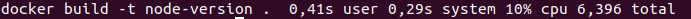

## Alpine
    -Tiempo construcción:
    

    -Tiempo test:

    -Tamaño:

## Node:10
    -Tiempo construcción:

    -Tiempo test:

    -Tamaño:

## Node:10-slim
    -Tiempo construcción:

    -Tiempo test:

    -Tamaño:

## Node:10-alpine
    -Tiempo construcción:

    -Tiempo test:

    -Tamaño:

**¿Mejor en tiempo de construcción?** 
Los mejores son node:10 y node:slim aunque con una diferencia en 0.03s con el resto, la construcción solo se realiza una vez por lo que no es algo determinante.

**Mejor en tamaño de la imágen**
El mejor en el tamaño de la imágen es alpine que tiene una diferencia de más 50MB frente a node:slim y de mas de 800MB frente a node:version.
Le sigue node:alpine con una diferencia de 25MB

**Mejor en tiempo de test**
El mejor es node:alpine, seuido de node:Version, node:slim y despues alpine.
Entre node:alpine y alpine hay una diferencia de 0.66s

Como podemos ver el más equilibrado es node:alpine, en tema de tamaño es el segundo menor con una diferencia mínima con alpine, y en velocidad es el mejor. Además realizando los test me he dado cuenta de que efectivamente como indique en la justificación de la elección, con alpine tengo que controlar node de manera externa.