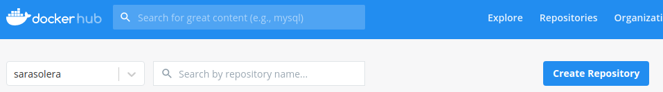
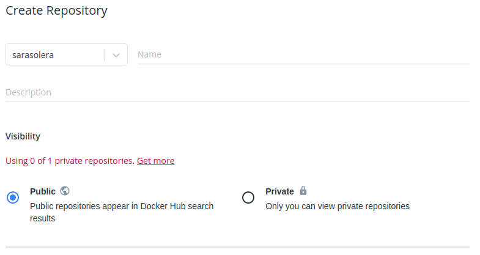
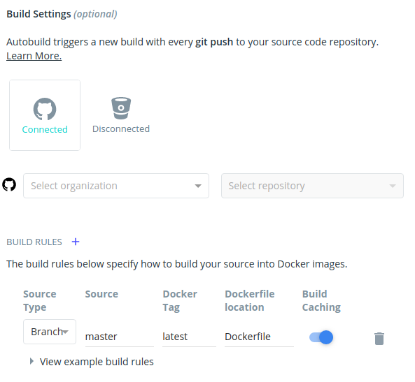
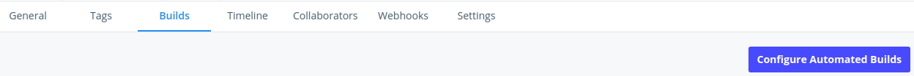
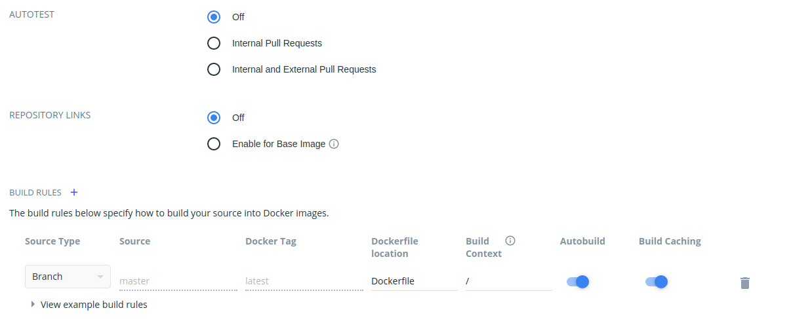

# DOCKER HUB
¿Qué es DockerHub?

Es un repositorio público en la Nube similar a Github. En él encontramos miles de imágenes, gratuitas, que se pueden descargar, y así no tener que hacer el trabajo desde 0, nos permite usar plantillas. Es decir, aquí podemos almacenar y conseguir todo lo necesario para dar vida a la instalación y uso de docker.

## ¿Cómo empezamos en DockerHub?
Lo primero es hacernos una cuenta, y tras ello debemos crear nuestro repositorio.

Cuando le damos a create nos muestra una especie de formulario en el que debemos introducir el nombre del repositorio, el mio es proyectoseries.

Si seguimos bajando en el formulario, encontramos las build setting. Debemos sincronizar nuestro repositorio de github con el de Docker hub para que se pueda mantener actualizado, tanto el README como el Dockerfile. Añadimos una regla de construcción, de esta manera cada vez que hagamos pull request a nuestro repositorio de github, dockerhub se actualizará y construirá.

## ¿Qué pasa si se me ha olvidado configurar la construcción automática en la creación del repositorio?
No pasa nada, nos metemos en el repositorio y vamos al apartado de builds y configure automated builds

Y nos sale de nuevo otro formulario.

Aqui podemos ver que podemos configurar cuando se generan las construcciones, cuando hagamos pull request nosotros, o cuando se haga también desde fuera, y las diferentes reglas de construcción, etc

