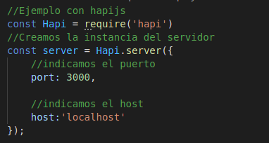
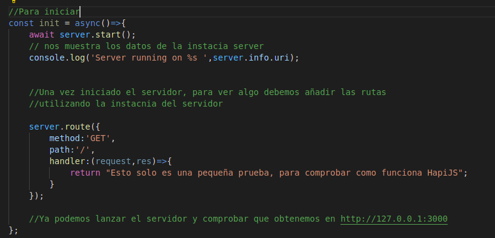
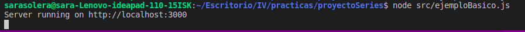
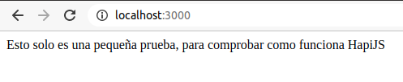

# ¿ Qué framework voy a utilizar ?
Cuando buscamos framework de nodejs podemos encontrar un abanico muy amplio de posibilidades, express es el más nombrado.
Entre los más populares podemos encontrar:

    - Meteor
    - Sails
    - Hapi

# ¿Por qué deberiamos usar Meteor?
    - Uso de módulos, su instalación ofrece todas las carácteristica básicas de una framework,pero si necesitas mayores  funciones, se puede extender.
    - Es de rápida respuesta, esto hace que todos los elementos se actualicen de manera automática, ofrece actualizaciones en tiempo real, esto es una carácteristica importante porque buscamos una herramienta que nos permita trabajar de manera ligera y rápida.
    - Meteor dispone de una plataforma en la nube llamada Glaxy que ha sido diseñada específicamente para poder implementr aplicaciones desarrolladas en meteor.

Un poco en resume, Meteor es un framework completo, extensible y rápido.

Testeando:
Para realizar los test meteor proporciona el comando meteor test. Hay bastante información, aunque propone mocha para realizar el testeao, en mi caso utilizo jest. 

Tras ello he leido una vez hecho un inicio rápido como sería la escalada, y aquí, según la información encontrada, podemos ver un punto flaco, ya que meteor tiene ciertas restricciones, como por ejemplo:

    - Viene incluido solo con la base de datos mongoDb.
    - No está integrado con npm, todos los paquetes de meteor son desarrollados por meteor.
    - Hay que tener cuidado, no seguir buenas prácticas podría provocar tener grandes cuellos de botella para la escalabilidad.

# ¿ Por qué deberiamos usar Sails?
 - Permite la generación y creación de proyectos de manera rápida y fácil.
 - Basado en Express, ya he tenido algunos ejemplos con él.
 - Fácil integración con WebSocket para la comunicación.
 - Usa grunt como gestor de tareas.

Para realizar el testeo, sails tambien cuenta con supertest, algo obvio ya que está implementado bajo express, de la misma manera los ejemplos que veo son a traves de mocha.

¿Qué desventajas podemos encontrar?

Sobretodo de documentación, sails es un framework joven, y aún no hay mucha documentación, ni post sobre errores no tan comunes.
Tarda en iniciarlo y a veces debe ser reiniciado.
La implementación según varias opiniones que he encontrado no llega a ser sencilla, por lo que retrasaría el desarrollo. 
 

# ¿Por qué deberiamos usar hapi?
    - Estable y de confianza.
    - Legibilidad del código. 
    - Permite realizar tareas internamente que otros framework deberían implementar con middleware.
    - Nos ofrece complementos para el enrutamiento, entrada, validación de salida, etc. 
    - Permite crear API escalables.

Hapi se propone como una buena opción, su punto fuerte es esa parte de complementos que ayuda a desarrollar una API de manera sencilla.

Una de sus ventajas principales es que proporciona un sistema de complementos robusto que permite agregar nuevas funciones y corregir errores a un ritmo rápido.

Para testear, hapi funciona con jest, por lo que al ser mi software de testeo, es algo bueno.

# Elección

Realmente para mi proyecto busco algo que me permita un desarrollo, correcto, simple y rápido. Según he buscado me gustan tanto Meteor como Hapi, aunque las 3 propuestas me proporcionan lo que necesito.

Aunque haya dudado tanto entre meteor, porque me gusta por su rápidez, por permitir realizar todo en javascript, pero me llama la atención probar los diferentes plugin o complementos que me puede ofrecer Hapi.

Por lo que, motivos por los que me decanto por hapi:

    - Complementos de enrutamiento, mi objetivo en este momento es trabajar con Api Rest, y hapi me lo puede proporcionar de una manera sencilla y rápida.
    - Permite crear API escalables, en un futuro, esto seguirá avanzando.
    - Viendo ejemplos el código no es muy dificil, es legible y queda claro lo que se hace en cada momento.

# Ejemplo de utilización con HapiJS
[Documentación oficial](https://hapi.dev/tutorials/?lang=en_US#-creating-a-server)
Servidor:
Creamos un nuevo objeto servidor.

Función para iniciar el servidor y añadir una ruta básica

Por ultimo debemos llamar a la función creada y tendremos a nuestra disposición el servidor y el path http://localhost:3000/

Resultado: 

