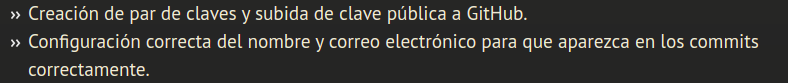
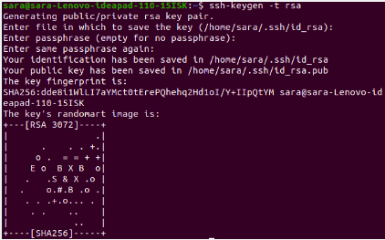
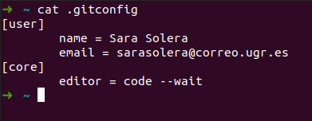
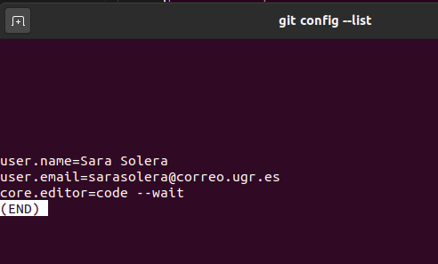
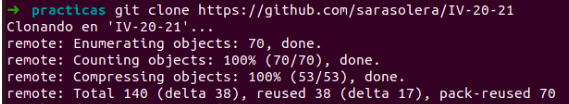
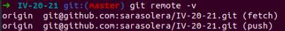

## Inicio git

#### ¿Qué teniamos que hacer?

#### Creacion de claves

Después simplemente copiamos la clave pública en github.

### Configuración correcta del nombre de usuario y correo electronico
El archivo con la configuración lo encotramos en ~, podemos acceder a él.

O utilizando el comando git config --list

En este caso aparte de mi correo y mi nombre, he indicado el editor que utilizo en mi caso Visual studio.

### Para la clonación de repositorios
Podemos utilizar https cómo indico el profesor en el video

O con ssh, se puede cambiar y pasar de https a ssh, para comprobar que el cambio tiene efecto: 

