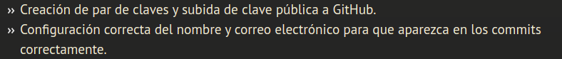
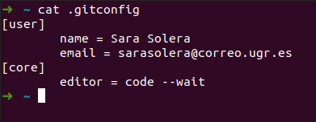
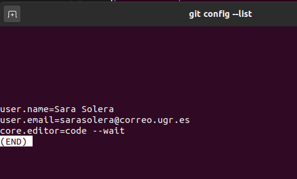
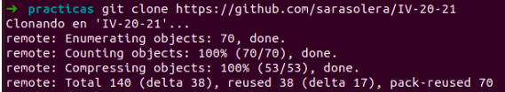
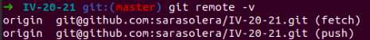

## Configuración git

#### ¿Qué teniamos que hacer?

### Creacion de claves

Después simplemente copiamos la clave pública en github.

### Configuración correcta del nombre de usuario y correo electronico
El archivo con la configuración lo encotramos en ~, podemos acceder a él utilizando el comando **cat .gitconfig** O utilizando el comando **git config --list**.

En este caso aparte de mi correo y mi nombre, he indicado el editor que utilizo, *Visual studio*.

### Para la clonación de repositorios
Podemos utilizar https cómo indico el profesor en el video o ssh. Es recomendable hacerlo siempre con ssh.
En la imagen veremos como se clona con HTTPS, para hacerlo con ssh hacemos:
 - git clone git@github.com:nick/nombre_proyecto.git

Si se ha clonado con HTTPS se puede cambiar con el comando:
 - git remote set-url origin git@github.com:nick/nombre_proyecto.git

Para comprobar que el cambio tiene efecto: 

