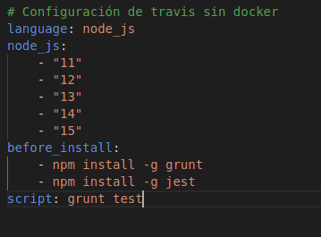

# Integración continua

La integración continua es algo necesario en la creación de un proyecto, ya que nos permite tener cualquier avance testeado, esto es algo imprescindible.
Genalmente la integración continua ocurre en la nube, una máquina virtual se descarga los ficheros, ejecuta los test y crea un informe, tras ello envia un correo al autor.

## ¿Qué sistemas en la nube podemos encontar?
    - Travis
    - Shippable
    - Circle-CI
    - AppVeyor
    - Jenkins, este se puede instalar en el propio ordenador, es bastante popular.

En primer lugar voy a utilizar travis. Motivos:

    - Porque es bastante popular, quiero que lo aprendido sea una herramienta para mi futuro y travis me puede servir.
    - Integrado con github, podemos ver el contenido y si pasan los test.
    - Compatible con distintos entornos de desarrollo, en mi caso, como ya he dicho varias veces es NodeJS, compatible con travis.d
    - Es open source.

Para hacer que funcione un sistema debemos darnos de alta, activar nuestro repositorio, generar nuestro fichero de configuración y empezar a construir.

En clase vimos un fichero de configuración para node, en mi caso lo que quiero hacer es ejecutar los test, tras los ejercicios obtuve un fichero de configuración pero solo con la versión 10 , en clase se pidió testear las diferentes versiones disponibles, la página oficial de [travis](https://docs.travis-ci.com/user/languages/javascript-with-nodejs/) recomienda probar con las últimas versiones de node, por lo que probaré desde la 11 hasta la 15

## Hablemos un poco del fichero de configuración de travis
En travis tenemos .travis.yml, este fichero está alojado en la raíz. Voy a explicar que ocurre según mi fichero:

¿Qué tenemos aquí?

    - Language: Según le indiquemos travis preparará la máquina para un lenguaje u otro, en mi caso travis creará una máquina virtual para ejecutar node.
    - NodeJS: en esta etiqueta es donde voy a indicar las diferentes versiones a probar.
    - Before install: en mi caso quiero ejecutar los test, para ello es necesario  instalar mi gestor de tareas grunt y el software con el que hago los test "jest".
    -Script: aquí vamos a indicar los comando sque queremos que se ejecuten en el entorno que nos genera travis. En mi caso grunt test, lo que hace que mis gestor de tareas ejecute los test.

## Comprobando las versiones.
Una vez realizado el fichero de configuración, empezamos a lanzar contrucciones, y automáticamente se carga travis, en caso de pasar el test se añadirían los cambios a la rama master, si no daria error y nos mandará una notificación. Para ello simplemente tenemos que lanzar las construcciones solo debemos hacer push a nuestro repositorio y travis disparará el proceso de build. **Modifiqué el fichero para hacer las versiones de 1 en 1 porque me tardaba mucho, realmente el problema era travis.org, por lo que migré el repositorio a travis.com y tardaban muy poco.**

Si comprobamos como va la construcción vemos que travis genera un entorno para cada una de las versiones.

Como vemos con las versiones mas recientes no tiene ningún problema, por lo que ya tenemos configurado travis para realizar los test con distintas versiones de node.
## ¿Dónde puedo ver que se están haciendo las construcciones?
Tanto en travis como en github podemos comprobarlo, en el caso de travis, podemos ver las construcciones en build history y en github en el inicio de nuestro repositorio.

