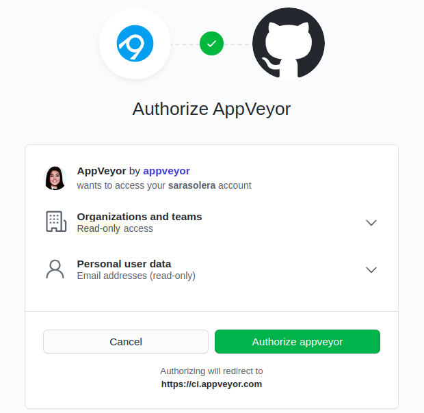
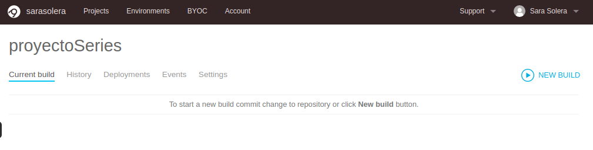
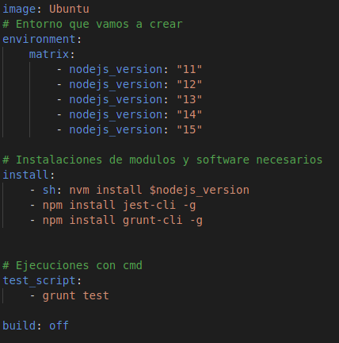
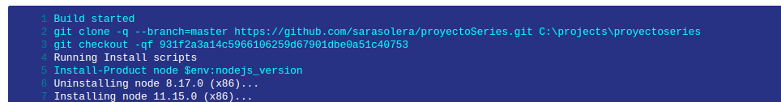

# Sistema de integración continua adicional
Como sistema adicional había varias opciones, y decidí probar [AppVeyor](https://www.appveyor.com/).

He seguido los pasos para iniciar en un sistema de CI:

    1. Crearme una cuenta, y enlazarla a github.
    2. Activar nuestro repositorio y añadirlo.
    3. Creamos el fichero de configuracion appveyor.yml, aunque también se puede hacer con la interfaz de usuario.

## Hablemos del fichero de configuracion en AppVeyor
Como ya he dicho el fichero de configuración se llama appveyor.yml.

¿Qué encontramos aquí?

- Image: indicando que la ejecución se va a hacer en ubuntu, es necesario para que clone bien la carpeta, ya que si no indicamos nada, por defecto utiliza windows, y se clona mal.
- Enviroment y matrix: app veyor permite realizar pruebas múltiples con matriz de compilación, en concretos vamos a probar las mismas versiones que en travis, para ello creamos las diferentes variables de entorno en una especie de matriz, luego se ejecutarán todas.
- Install: para realizar la instlación de modulos y dependencias antes de la ejecución de los test. Como vemos con sh y nvm instalamos las diferentes versiones de node, tras ello instalamos las dependencias y los programas necesarios en mi caso grunt y jest.
- Test_script: en appveyor tenemos una sección propia de fase de prueba para ejecutar los test, para ellos indicamos tras la etiqueta test_script el comando necesario para realizarlos. Para deshabilitar esta fase se puede poner test:off
- Build:  modo de construcción,appVeyor por defecto funciona en MSBuild que hace que se busque un proyecto visual estudio o un archivo de solución en la raíz, se puede modificar y hacer su alternativa, "script", o simplemente deshabilitar esta función sin necesidad de script. Para ello hacemos build:off.

## Problemas que he encontrado
    1. En el fichero inicial no indique la imagen que iba a usar, al clonar en windows no encontraba los ficheros necesarios, el aviso me lo daba tras hacer grunt test, por lo que achaqué el error a grunt, más tarde me dí cuenta que era problema de la clonación revisando a fondo el fichero log.
    2. Instalación de las versiones, es necesario generar variables de entorno y despues instalar la versión, yo utilizaba un comando equivoca, y la página oficial da por defecto los comandos para windows. Para instalar es necesario usar nvm.

Cómo clona por defecto:

## Páginas de donde me he documentado
[Prueba con Node.js](https://www.appveyor.com/docs/lang/nodejs-iojs/).

[Introducción a AppVeyor para linux](https://www.appveyor.com/docs/getting-started-with-appveyor-for-linux/#quick-start).

[Configuración](https://www.appveyor.com/docs/build-configuration/#build-matrix).
    

    