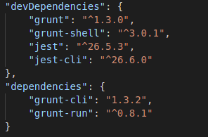
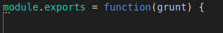
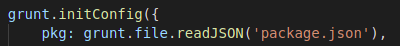
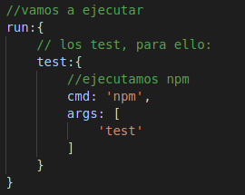
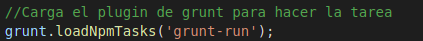
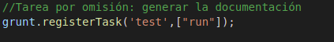

# GRUNT 
Grunt es una herramientas que nos permite hacer más simple el proceso de construcción de proyecto en Javascript, con él podemos automatizar una serie de pasos y procesos.

¿Por qué usar grunt?
Cada vez los proyectos que se realizan son más grandes e inviables de tratar directamente, por eso debemos hacer uso de tecnicas como concatenar varos archivos en un único archivo para optimizar la operacion.

## Instalación

    - npm install -g grunt-cli

    - -g es instalar de manera global

## Dependencias
Una vez instalado en nuestro sistema, debemos añadir las dependencias, en mi caso, a mi fichero package.json.
Para instalar y añadir dichas dependencias ejecutamos:

    - npm install [nom_dependencias] --save-dev

Indicamos grunt y grunt-run que se usa para ejecutar.

## GRUNTFILE
¿Qué es el gruntfile?

Como ya he dicho, grunt automatiza tareas, pero... ¿Dónde indicamos esta automatización?
La respuesta es en el gruntfile, básicamente aqui declararemos todas las tareas que vamos a invocar.
Se compone de las siguientes partes:

 - La función "envoltorio" -- Todo el código Grunt debe especificarse dentro de esta función.

 - La configuración de proyectos -- La mayoría de tareas se basan en los datos de configuración definidos en un objeto que se para al método grunt.initConfig() en nuestro caso el package.json. Si indicamos este fichero se importan los metadas almacenamos en package. 

 

 - Configuración de tareas -- Despues indicamos la tarea a ejecutar en mi caso quiero ejecutar los test, por lo que la tarea es run y en test indicamos cómo se hace, en mi caso npm test.

 

 - Carga de complementos y tareas -- Carga el plugin de grunt para ejecutar la tarea
 

- Tareas personalizadas -- Por último registramos el task para poder ejecutarlo:

Y por último para ejecutarlo serie:

    - grunt run:test

Y ya hemos automátizado una tarea con el Task Runner: Grunt.
El resto del código Gruntfile.js se encuentra el la raíz de mi proyecto.

