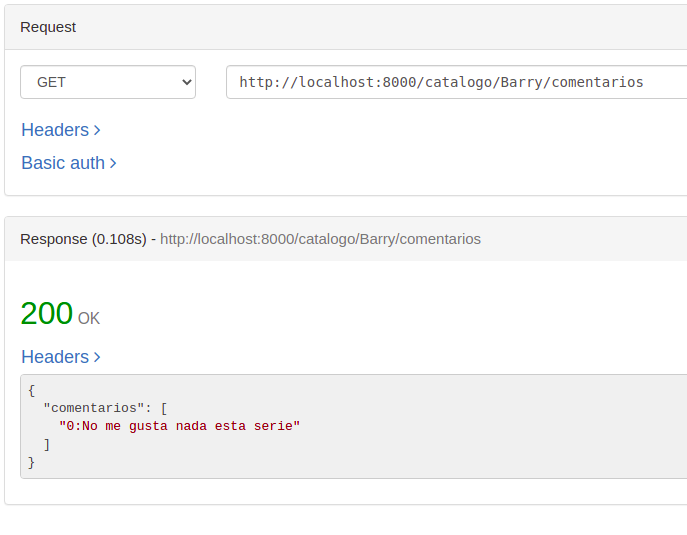

# Diseñando Api con Hapijs

## Inicio
Lo primero es instalar hapijs como dependencia en nuestro proyecto.

- npm i hapi --save

Hapi tiene una completa documentación que podemos encontrar en su página [oficial](https://hapi.dev/).

Vamos a crear el fichero [rutas](https://github.com/sarasolera/proyectoSeries/blob/master/src/rutas/rutas.js) donde añadiremos la instancia del servidor y las rutas.

**Buena práctica** meter el puerto en una variable de entorno, para ello usamos las variables de entorno en node, si no encontramos ningun puerto en process.env.PORT, en su defecto, si no se encuentra valor para esta variable, el puerto será 8000.

Ademas del server es necesario el atributo host, ambos son obligatorios.

## Siguiente paso. Rutas
Comenzamos con las rutas, podemos definir las rutas en nuestro fichero donde levantariamos el servidor, o en un fichero aparte.

Una **buena práctica** es realizar módulos, es decir, separar lo posible, para asi permitir la reutilización en un futuro. 

Las rutas permiten las peticiones HTTP a nuestro microservicio.

En un futuro, este fichero lo generaré como modulo para ello en hapijs tendremos:

    - name ~ será unico en nuestra aplicación, no podemos tener más de un pluggin con el mismo nombre.
    - register ~ basicamente contiene la lógica para registrar el plugin en el servidor.

Mediante server.route vamos a introdrucir las rutas.
Declaramos una ruta para el servidor, indicando el método, como ya sabemos los métodos son:
 - GET para consultar algo.
 - POST generalmente para crear instancias o sustituir.
 - PUT para cambiar parte de un recurso.
 - DELETE para eliminar.

En path indicamos la ruta, si queremos añadir un parametro lo debemos poner con {}, y añadir ? si es optativo.

De esta manera ya tenemos una ruta básica / y el servidor.

Comienza la integración real con mi proyecto.

# Primera HU , test e implementación

En este apartado aprovecho para explicar las implementaciones que debo hacer, los test, middleware y log.

Para comenzar a trabajar un poco con mi clase, lo primero era testear la petición que iba a hacer.
Para ello me he creado un [fichero api.test.js](https://github.com/sarasolera/proyectoSeries/blob/master/tests/api.test.js) y la primera ruta que voy a establecer es '/catalogo', que cubre mi [HU02:Consultar Catalogo](https://github.com/sarasolera/proyectoSeries/issues/18).

## Test

Para realizar los test, se puede usar **lab** que es parte de la familia de hapijs, pero jest permite ser usado del lado del servidor, y proporciona mayor velocidad por lo que utilizaré **jest**. 

Documentación [testing de la página oficial](https://hapi.dev/tutorials/testing/?lang=en_US)

La documentación oficial utiliza lab por lo que yo busqué una documentación adicional con [jest](https://rockyj.in/2017/03/25/hapijs-jest.html), que también he consultado.

Para realizar el test:

    - Creo una variable options que incluye el método y el path de la petición de ejemplo que vamos a usar para testear. 
    - Con server.inject generamos la petición en el controlador de la ruta, esta es la manera de probar los métodos HTTP, la respuesta la guardamos en data. Este metodo es utilizado para evitar llamar a server.start() y tener que abrir sus puertos.
    - Con expected indicamos que respuesta esperamos, que el tipo sea JSON y que el código sea 200, de éxito o 404 NotFound.

Para saber lo que contenia data, y analizar los resultados, hice un console log de data, y pude observar, que el tipo de header lo podiamos obtener con data.headers['content-type] y el código mediante statusCode.

Comprobamos si nuestra GET ruta responde con estado 200, es decir, éxito, y si devuelve un objeto JSON.

Una vez tengo testeado lo que quiero obtener de esa ruta, la implementamos. 

Para ello primero voy a realizar una clase controladora, que me permita trabajar los datos, y así mantener la lógica de negocio.

Esta clase me va a permitir acceder y modificar mis datos, sin necesidad de modificar el resto de funciones, aunque ahora mismo no tengo base de datos, me servirá en un futuro, y me reducirá el número de cambios.

Como siempre cualquier código debe ser testeado por empezaré realizando el test de la clase.

En el fichero [controladorSeries.test.js](https://github.com/sarasolera/proyectoSeries/blob/master/tests/controladorSeries.test.js) se encuentran los test realizados a las funciones.

En el fichero [controladorSeries.js](https://github.com/sarasolera/proyectoSeries/blob/master/src/controlador/controladorSeries.js) las funciones que controlan los datos que necesito.

El código de test y funciones está comentado.

## Middleware o plugin con Hapijs
Ya tenemos una implementación con su test, pero es necesario controlar los errores.

Como ya dije en la elección de framework, me parecia interesante que Hapijs tuviera algunos pluggin que permitieran sustituir los middleware que proponen frameworks como  express. 

El trabajo ha sido realmente costoso, ya que al no usar middleware, he tenido que consultar bastante información para saber qué debía implementar. Trar un tiempo encontré la página [npmjs](https://www.npmjs.com/package/hapi-error), en la que leí que cuando hay un error en el ciclo de solicitud / respuesta, se produce un objeto Boom, con un formato, y que además habia una forma de interceptar este error con un complemento que se invoca antes de devolver la respuesta.

Complemento que se invoca antes de generar la respuesta:

Hapi usa la biblioteca boom para toda la generación de errores.

Con server.ext registramos eventos en uno de los puntos del ciclo de vida de la solicitud, **onPreResponse** es el punto donde se genera el evento, en mi caso es antes de responder al cliente, este evento siempre es llamado a menos que se anule la solicitud, al entrar comprueba si el objeto es boom, que estariamos ante un error, y si no lo es sigue adelante con la respuesta.
https://www.npmjs.com/package/hapi-error

Cuando captamos que ha dado error devolvemos el codigo y el error obtenido.

Antes de todo, cree una clase ErrorPropio que heredaba de error, para poder controlar los errores y generarlos con un mensaje y un código propio.
La clase la podemos encontrar en el [error.js](https://github.com/sarasolera/proyectoSeries/blob/master/src/error.js)

Cuando se lance una excepción, el mensaje repsonse será del Boom y con el captaremos los datos del error.

## Ruta para HU
Para ello en el fichero [rutas.js]() incluyo, en server.route, el metodo GET y la ruta /catalogo, devolveremos el nombre de todas las series en el catálogo, para ello llamamos al método obtenerSeries de catálogo, lo devolvemos junto al código 200 de éxito.

Pasamos los test: 

**NOTA IMPORTANTE** :

    Los ejemplos que vienen a continuación se hicieron antes de la corrección de eliminar el levantamiento de servidor innecesario, por lo que, realmente ahora mismo no se podrían hacer.
    ¿Por qué los he dejado? Simplemente me parece una forma muy sencilla de ver el funcionamiento si tuviera el servidor iniciado, y  no me gustaría borrar el trabajo que conllevaron.

Podemos ver que nos devuelve la petición mediante:

    - Navegador
    - Curl
    - Rested, es una herramienta que aprendí recientemente.

Iniciamos el servidor:
- Con navegador

- Curl

- Rested:

De esta manera ya queda cubierta la [HU02 Consultar Series]().

# Log
Mantener la traza de procesos de la api nos permitirá comprobar su comportamiento. La información que queremos registar será, que evento ha ocurrido.
Aunque podriamos utilizar un sistema de log, 
Hapijs cuenta con server.events.on que permite captar todos los eventos que ocurran.

Podemos mostrar los eventos de petición, simplemente creo un req.log("tag","mensaje")

Podemos captar estos eventos lo hacemos mediante server.events.on.request, voy a controlar que haya un error, en caso de haber error, en tags el booleano error se pone a "true"

Además voy a mostrar los eventos emitidos despues de enviar la respuesta al cliente, de esa manera muestro el tipo de evento, y el código devuelto.

En este log voy a mostrar:

    - De request --> la dirección de local host, el método de petición y la ruta.
    - De response --> El código que se ha enviado con la respuesta.

Log que obtengo:

Por cada petición obtendremos el mensaje log correspondiente y se mostrará en la terminal.

# Resto de HU

Para realizar la [HU01 Consultar serie de nuestro catalogo](https://github.com/sarasolera/proyectoSeries/issues/7) dado un nombre obtengo los datos de dicha serie.

Para ello, he creado la función buscarSeries en [catalogo.js](https://github.com/sarasolera/proyectoSeries/blob/master/src/catalogo.js) para encontrar el indice de la serie dado su nombre, y he añadiendo el test correspondiente en [catalogo.test.js](https://github.com/sarasolera/proyectoSeries/blob/master/tests/catalogo.test.js).

En [controladorSeries.js](https://github.com/sarasolera/proyectoSeries/blob/master/src/controlador/controladorSeries.js) he añadido la función obtenerSerie(nombre_serie), que utiliza la función citada anteriormente, y genera una lista con el nombre y la sinopsis de la serie. En este caso he añadido también el test en [controladorSeries.test.js](https://github.com/sarasolera/proyectoSeries/blob/master/tests/controladorSeries.test.js)

En [rutas.js](https://github.com/sarasolera/proyectoSeries/blob/master/src/rutas/rutas.js) he añadido la ruta correspondiente /catalogo/{nombre_serie} para acceder a cada serie, asi queda abarcada la HU01 Consultar serie de nuestro calalogo.

Mediante {nombre_serie} indicamos que vamos a recibir por parámetro el nombre de la serie que queremos consultar.

Captar con: req.params.nombre_serie:

Para captar el valor de este parametro accedemos a req y mediante params  indicamos que vamos a captar parametros y tras ello introducimos el nombre del parametro a captar, .nombre_serie.

Para cada código hemos creado su test [app.test.js](https://github.com/sarasolera/proyectoSeries/blob/master/tests/api.test.js)  con el testeo correspondiente.

Prueba con una serie incluida en el catálogo: 

Prueba serie no incluida en el catálogo:

Este procedimiento sigo para el resto de HU implementadas por lo que no voy a enlazar de nuevo los ficheros, pero comentaré algunas cosas.

Para la [HU03 Consultar catalogo por puntuación](https://github.com/sarasolera/proyectoSeries/issues/19).Simplemente añadimos la función  obtenerSeriesPuntuación y vamos a obtener una lista de las series, con su nombre su numero de temporadas y su puntuación, ordenadas de mayor a menor.
Añadimos la ruta correspondiente y podemos ver el contenido.

Voy a implementar HU que me permitan realizar las operación POST, PUT y DELETE.

Comienzo con  [HU05 Comentar serie](https://github.com/sarasolera/proyectoSeries/issues/33)

Añadimos en el controlador la función comentarSerie, que añade a la serie que pasemos en la URL, el comentario que pasemos en comentario.

La ruta queda así:

Como vemos en la ruta vamos a captar el nombre y el comentario de la serie de la url. 
El test queda de esta manera. Vamos a indicar el nombre de la serie y el comentario de ejemplo, si todo es correcto devolvemos código 200 y tipo json.

 Para probarlo usamo rested

Para consultar lo comentarios añadidos a una serie implementamos [HU07 Consultar comentarios de una serie](https://github.com/sarasolera/proyectoSeries/issues/35) 

En {nombre} - Indicamos el nombre de la serie de la que queremos consultar los catalogos.

Y añado /comentarios - para indicar que es con lo que estamos tratando.

Incluimos un par de comentarios. 

Para realizar un método PUT he generado la [HU10 Editar comentario](https://github.com/sarasolera/proyectoSeries/issues/50), he tenido que implementar funciones que no tenía en mi clase [serie.js](https://github.com/sarasolera/proyectoSeries/blob/master/src/serie.js) y en mi clase [catálogo](https://github.com/sarasolera/proyectoSeries/blob/master/src/catalogo.js), y sus test correspondientes en [testSerie](https://github.com/sarasolera/proyectoSeries/blob/master/tests/serie.test.js) [testCatalogo](https://github.com/sarasolera/proyectoSeries/blob/master/tests/catalogo.test.js)

Ademas como siempre añadimos la funcion en controlador y añadimos la ruta. En este caso la ruta queda así.

Podemos ver que captamos la serie, el indice del comentario y el comentario nuevo.

Pruebas: 

 - Añado comentario: 

 - Consultamos comentario:

 - Modifico comentario:

 - Consultamos para ver modificación:

Si intentamos modificar un comentario que no éxiste: 

Por último quiero probar método DELETE, al igual que con modificar no tenia ninguna historia de usuario que me lo permitiera por loq ue tuve que crear la [HU11 Eliminar Comentario](https://github.com/sarasolera/proyectoSeries/issues/51)

El procedimiento será practicamente igual, cambiando los métodos. 
La ruta queda:

Captamos el nombre de la serie, y el comentario a eliminar. Si no existe ese cometario dará error, si existe sigue el procedimiento llamando a la función de controlador, que utiliza las funciones de la clase catalogo y la clase serie correspondientes.

Prueba eliminando un comentario inexistente.

Prueba eliminando un comentario existente, el 0:

Consulto comentarios:

Elimino comentario:

Consulto comentarios:

