# GITHUB y VERCEL  
Antes de todo y por si alguien se lo pregunta...
¿Qué es Vercel? En resumen, Vercel es una plataforma que permite el despliegue de funciones serverless de una manera sencilla, que permite enlazar GitHub, GitLab o Bitbucket para implementar y desplegar automáticamente nuestro proyecto.

## Conexión Vercel y Github
Lo primero es estar registrado en vercel, y tener un proyecto en github, una vez tenemos ambos, para importar el proyecto:
 1.  En overview clicamos en Import Project y entre las opciones elegimos importar un repositorio git.

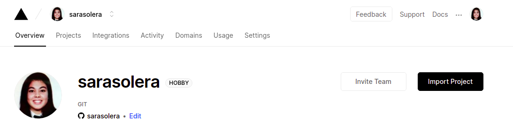 

 2. Nos pide es la URL de nuestro proyecto, y tras eso pide que seleccionemos el directorio que contiene el codigo fuente, dado que en mi caso aun no sé si voy a tener que utilizar más de una carpeta importaré el repositorio.
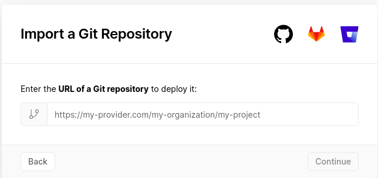
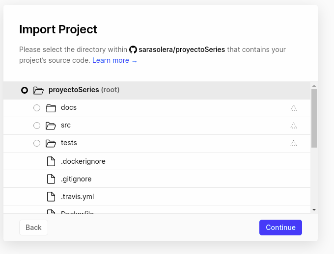

 3. Dado un nombre podemos desplegar.
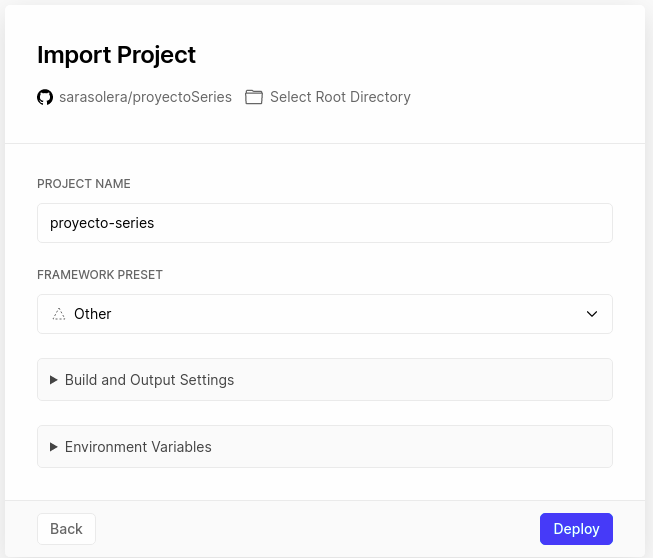
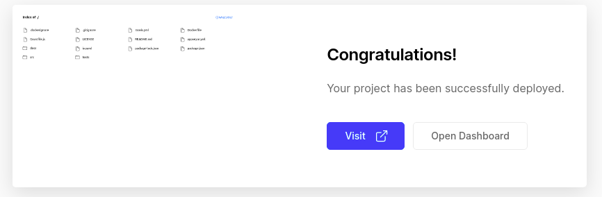

 4. En los ejercicios tuvimos que instalar vercel cli, para implementar el proyecto ejecutamos:

    - vercel, al ejecutra vercel nos preguntara que proyecto queremos implimentar, y si vamos a vincular uno ya existente o uno nuevo.
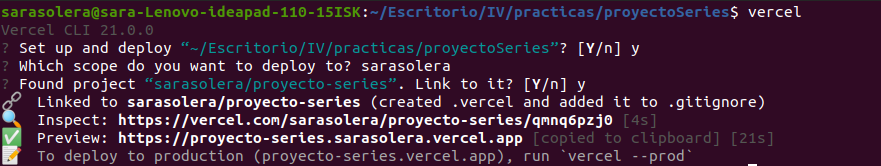
    - Vemos que para desplegar nos indica que devemos ejecutar el comando vercel --prod

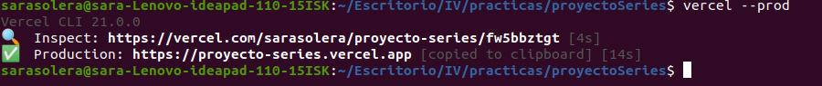

## Puesta en marcha
Ya tenemos nuestro repositorio enlazado a github, ahora voy a mostrar un ejemplo de despliegue de una función. Para ello en Vercel es necesario tener la carpeta "api" en la que incluir el fichero.
Para tomar contacto he hecho una función que capta dos valores, los suma y devuelve el resultado. Al estar conectados github y vercel, cada vez que hagamos git push, se hará automáticamente la construcción en vercel.

Función suma:

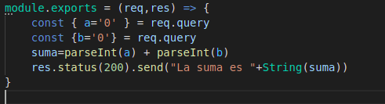
Como podemos ver tenemos:

    - req: aquí vamos a tener la petición, a través de la query string, en este caso podemos obtener el valor de a y el valor de b, en caso de no recibir nada en a, o en b, o en ambas, el valor por defecto es 0.
    - status: es una función para establecer el código de estado que se envía con la respuesta, 200 es una respuesta estándar para solicitudes HTTP exitosas.
    - send: es una función en la que enviamos la respuesta, donde el contenido de send debe ser string, un objeto o un buffer.
    - res: simplemente será la forma de enviar la respuesta, como hemos visto las devoluciones en res pueden estar encadenadas, en este caso enviamos el código de estado y la suma.

En la [página oficial de vercel](https://vercel.com/docs/runtimes#official-runtimes/node-js/node-js-request-and-response-objects) podemos encontrar los diferentes tipos de request y de response.

Los diferentes códigos de estado los podemos encontrar [aquí](https://en.wikipedia.org/wiki/List_of_HTTP_status_codes)

Una vez realizada la función vamos a desplegar, para ello, simplemente hacemos git push de nuestra carpeta /api con el fichero suma.js

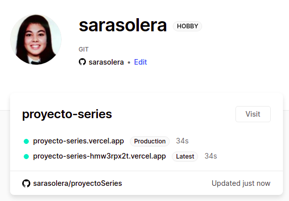

Seleccionamos poyecto-series.vercel.app, clicamos en visit y nos da acceso a nuestras carpetas, si clicamos en api el resultado será:

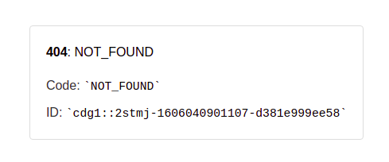

Debemos añadir en la query string nuestro fichero, es decir, **/suma.js**

Como ya he dicho si no añadimos ningún valor, por defecto a y b serán 0 por lo que:

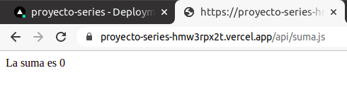

Para dar valor a varios parametros debemos añadir **&** entre medias:

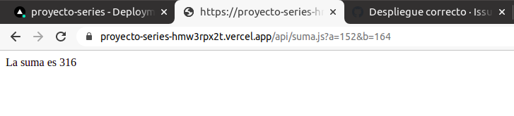

Tambien podemos darle valor solo a una de las variables:

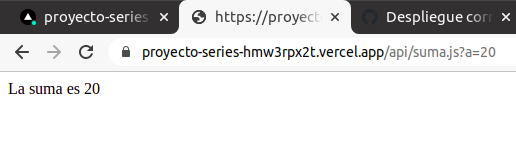

Diferentes enlaces de prueba:

[Suma a=100 ](https://proyecto-series-hmw3rpx2t.vercel.app/api/suma.js?a=100) - Resultado: La suma es 100.

[Suma a=82 y b=38](https://proyecto-series-hmw3rpx2t.vercel.app/api/suma.js?a=82&b=38) - Resultado: La suma es 120.

[Suma b=36](https://proyecto-series-hmw3rpx2t.vercel.app/api/suma.js?b=36) - Resutado: La suma es 36.

Esto es un ejemplo simple, pero nos permite ver como se puede desplegar una función serverless fácilmente. Para la integración con el proyecto pondré a prueba mis funciones, la documentación de este la podemos encontrar enlazada en el README.