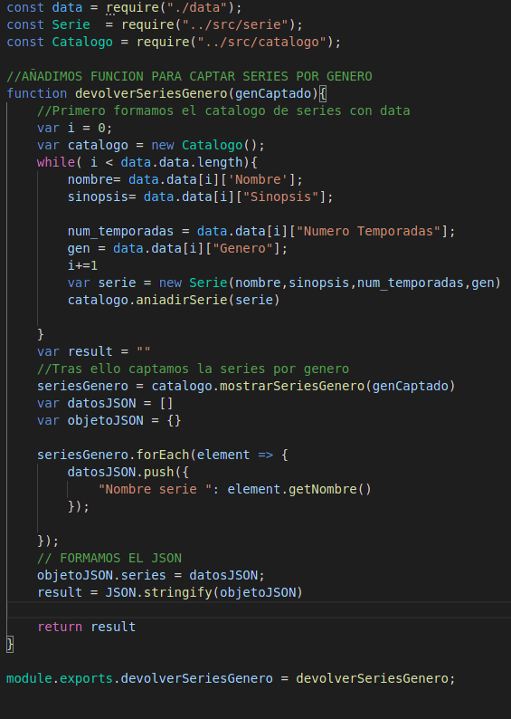
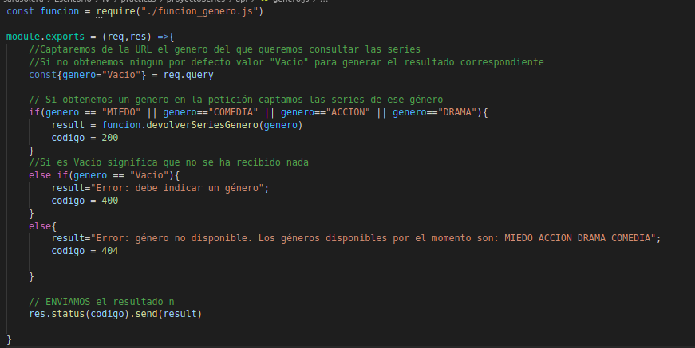

# GITHUB y VERCEL  
Antes de todo y por si alguien se lo pregunta...
¿Qué es Vercel? En resumen, Vercel es una plataforma que permite el despliegue de funciones serverless de una manera sencilla, que permite enlazar GitHub, GitLab o Bitbucket para implementar y desplegar automáticamente nuestro proyecto.

## Conexión Vercel y Github
Lo primero es estar registrado en vercel, y tener un proyecto en github, una vez tenemos ambos, para importar el proyecto:
 1.  En overview clicamos en Import Project y entre las opciones elegimos importar un repositorio git.

 

 2. Nos pide es la URL de nuestro proyecto, y tras eso pide que seleccionemos el directorio que contiene el codigo fuente, dado que en mi caso aun no sé si voy a tener que utilizar más de una carpeta importaré el repositorio.

 3. Una vez le damos un nombre podemos pasar a realizar el despliegue.

 4. En los ejercicios tuvimos que instalar vercel cli, para implementar el proyecto ejecutamos:

    - vercel, al ejecutra vercel nos preguntara que proyecto queremos implimentar, y si vamos a vincular uno ya existente o uno nuevo.

    - Vemos que para desplegar nos indica que debemos ejecutar el comando vercel --prod

## Puesta en marcha
Ya tenemos nuestro repositorio enlazado a Github, ahora voy a mostrar un ejemplo de despliegue de una función. Para ello en Vercel es necesario tener la carpeta "api" en la que incluir el fichero.

## Toma de contacto con ejemplo propio
Para tomar un poco más de contacto con la plataforma he hecho una función que capta dos valores, los suma y devuelve el resultado. Al estar conectados Github y Vercel, cada vez que hagamos git push, se hará automáticamente la construcción en Vercel.

Función suma:

Como podemos ver tenemos:

    - req: aquí vamos a tener la petición, a través de la query string, en este caso podemos obtener el valor de a y el valor de b, en caso de no recibir nada en a, o en b, o en ambas, el valor por defecto es 0.
    - status: es una función para establecer el código de estado que se envía con la respuesta, 200 es una respuesta estándar para solicitudes HTTP exitosas. En este punto, vemos que nuestro código siempre va a devolver 200 ya que si no se introduce en la URL un valor para el parámetro 'a' o para el 'b', tomaremos que por defecto el valor de dichos parámetros es 0. Esto podría enfocarse de otra forma y podríamos devolver un status(400) cuando no se proporcione alguno de estos valores, ya que tendríamos una Bad Request, o podríamos devolver nosotros un mensaje de error indicándole al usuario qué ha fallado.
    - send: es una función en la que enviamos la respuesta, donde el contenido de send debe ser string, un objeto o un buffer.
    - res: simplemente será la forma de enviar la respuesta, como hemos visto las devoluciones en res pueden estar encadenadas, en este caso enviamos el código de estado y la suma.

En la [página oficial de vercel](https://vercel.com/docs/runtimes#official-runtimes/node-js/node-js-request-and-response-objects) podemos encontrar los diferentes tipos de request y de response.

Los diferentes códigos de estado los podemos encontrar [aquí](https://en.wikipedia.org/wiki/List_of_HTTP_status_codes)

Una vez realizada la función vamos a desplegar, para ello, simplemente hacemos git push de nuestra carpeta /api con el fichero suma.js

Seleccionamos proyecto-series.vercel.app, clicamos en visit y nos da acceso a nuestras carpetas, si clicamos en api el resultado será:

Debemos añadir en la query string nuestro fichero, es decir, **/suma.js**

Como ya he dicho si no añadimos ningún valor, por defecto a y b serán 0 por lo que:

Para dar valor a varios parámetros debemos añadir **&** entre medias:

Tambien podemos darle valor solo a una de las variables:

Aquí dejo un listado con los diferentes enlaces a los que podemos acceder para ver que efectivamente las pruebas funcionan correctamente.
[Suma a=100 ](https://proyecto-series-hmw3rpx2t.vercel.app/api/suma.js?a=100) - Resultado: La suma es 100.

[Suma a=82 y b=38](https://proyecto-series-hmw3rpx2t.vercel.app/api/suma.js?a=82&b=38) - Resultado: La suma es 120.

[Suma b=36](https://proyecto-series-hmw3rpx2t.vercel.app/api/suma.js?b=36) - Resutado: La suma es 36.

Este es un ejemplo simple, pero nos permiten ver cómo se puede desplegar una función serverless fácilmente. Hecho esto vamos a pasar a ir más allá de un ejemplo y vamos a desplegar una función relacionada con nuestro proyecto. 

# Más allá de un simple ejemplo: despliegue de una función de nuestro proyecto en Vercel.
Para no quedarme en el ejemplo, he querido avanzar en la [HU04](https://github.com/sarasolera/proyectoSeries/issues/20) que permite al usuario consultar series de un mismo género, de esta misma función haré el bot de telegram.

Para ello y fijándome en el ejemplo de JJ [netlify-covid](https://github.com/JJ/netlify-covid-and), he realizado un fichero de datos con las diferentes series, incluyendo nombre de la serie, sinopsis, número de temporadas actuales y por supuesto género al que pertenecen.

En mi caso el fichero [data.js](https://github.com/sarasolera/proyectoSeries/blob/master/api/data.js): es una lista de diccionarios, cada diccionario una serie con sus atributos.

Tras ello he hecho el fichero [genero.js](https://github.com/sarasolera/proyectoSeries/blob/master/api/genero.js) en el que tenemos la función, del fichero data.js generamos series y con las series el catálogo, ya que tengo en la clase catálogo la función mostrarSeriesGenero que nos devuelve un array de series según el género especificado.

Para formar el JSON me he fijado en [stackoverflow](https://es.stackoverflow.com/questions/150520/crear-un-json-en-javascript) con un ejemplo, en definitiva hay que crear una lista con los diccionarios de las series que queremos obtener, cada diccionario contiene el nombre, la sinopsis y el número de temporadas de cada serie de ese género.
Lista de series según género:
 - ACCIÓN: La casa de papel
 - DRAMA: YOU , Riverdale
 - COMEDIA: Barry , La casa de las flores
 - MIEDO: Stranger things, La maldición de Hill Hounting, The Walking Dead.

Al utilizar la misma función para la función en Vercel y para el bot, he decidido incorporar la función en un [fichero](https://github.com/sarasolera/proyectoSeries/blob/master/api/funcion_genero.js) a parte, y así puede ser utilizada por ambos, evitando repetir un código común. 

Vamos a ver la implementación de dicha función:

Aquí como vemos, importamos aquellas clases que vamos a utilizar y obtenemos los datos de *data.js*. El parámetro de la función es el género del cual queremos obtener las series del catálogo, simplemente generamos las series y el catálogo a partir del fichero que nos proporciona información.
Una vez tenemos el catálogo procedemos a captar las series en función del género demandado. Para ello recurrimos a nuestra función *mostrarSeriesGenero*, perteneciente a la clase catálogo, que guardará en la variable *seriesGenero* todas las series cuyo género corresponda al pasado por parámetro. Con todas ellas formamos un JSON que devolvemos.Para formar el JSON me he fijado en [stackoverflow](https://es.stackoverflow.com/questions/150520/crear-un-json-en-javascript) con un ejemplo, en definitiva hay que crear una lista con los diccionarios de las series que queremos obtener, cada diccionario contiene el nombre de la serie.

Ahora explicaré la función desplegada en Vercel, que hará uso de la función explicada anteriormente y como he comentado al principio, está relacionada con la [HU04](https://github.com/sarasolera/proyectoSeries/issues/20)

 

Aquí simplemente importamos la función generada. Debemos fijarnos en que si el usuario no introduce ningún valor para el parámetro *género*, tomaremos por defecto "Vacío" y en este caso le mostraremos un mensaje indicándole que debe indicar algún género, para ello devolvemos el código 400 . Por otro lado, si el género que indica no corresponde a ninguno de los permitidos, es decir, a 'miedo', 'comedia', 'acción' o 'drama', le mostraremos un mensaje indicándole que dicho género no está disponible, para ello error 404 que significa que no se encuentra el contenido solicitado, en caso de ser un género válido, llamamos a la función y devolvemos las series pertenecientes a él.

Finalmente, devolvemos el resultado que corresponda a la petición realizada por el usuario.

Aquí dejo un listado con diferentes enlaces y el resultado que obtenemos de ellos:
 - [Pasándole MIEDO como género.](https://proyecto-series-i0ab2i95j.vercel.app/api/genero.js?genero=MIEDO)

   
 - [Pasándole FANTASÍA como género.](https://proyecto-series-i0ab2i95j.vercel.app/api/genero.js?genero=FANTASIA)

   

 - [NO pasar ningún género.](https://proyecto-series-i0ab2i95j.vercel.app/api/genero.js)

   